# Лабораторна робота 2. Створення складних SQL запитів

## Загальна інформація

**Здобувач освіти:** Кучерук Максим Сергійович
**Група:** ІПЗ-31
**Обраний рівень складності:** 3

## Виконання завдань

### Рівень 1

#### 1. З'єднання таблиць

**Завдання 1.1:** INNER JOIN - список товарів з категоріями та постачальниками

```sql
SELECT 
    p.product_id,
    p.product_name, 
    c.category_name, 
    s.company_name AS supplier_name, 
    p.unit_price
FROM products p
INNER JOIN categories c ON p.category_id = c.category_id
INNER JOIN suppliers s ON p.supplier_id = s.supplier_id
ORDER BY c.category_name, p.product_name;

```

**Результат виконання:**
```
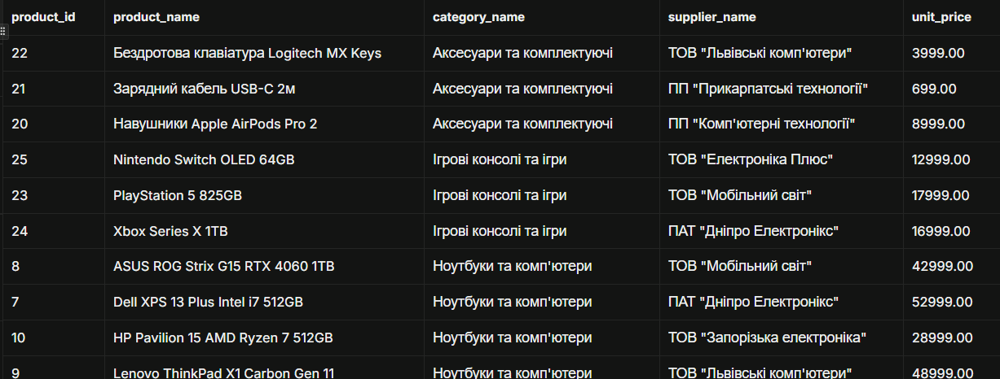

```

**Пояснення:** Цей запит формує повний каталог товарів із додаванням контекстної інформації про їхню категорію та постачальника.

Таблиці, що з'єднуються:

products (p) — основна таблиця з товарами.

categories (c) — довідник категорій, з'єднується через category_id.

suppliers (s) — довідник постачальників, з'єднується через supplier_id.

Принцип роботи: Оскільки використовується INNER JOIN, у підсумкову вибірку потрапляють лише ті товари, для яких одночасно існують відповідні записи і в таблиці категорій, і в таблиці постачальників (тобто значення category_id та supplier_id не є NULL і мають відповідники в батьківських таблицях).

Сортування: Результат впорядковується спочатку за назвою категорії за алфавітом (c.category_name), а всередині кожної категорії — за назвою товару (p.product_name).


**Завдання 1.2:** LEFT JOIN - клієнти з кількістю замовлень

```sql
SELECT 
    c.customer_id,
    c.contact_name, 
    c.customer_type, 
    r.region_name,
    COUNT(o.order_id) AS order_count
FROM customers c
LEFT JOIN orders o ON c.customer_id = o.customer_id
LEFT JOIN regions r ON c.region_id = r.region_id
GROUP BY c.customer_id, c.contact_name, c.customer_type, r.region_name
ORDER BY order_count DESC;

```

**Результат виконання:**
```
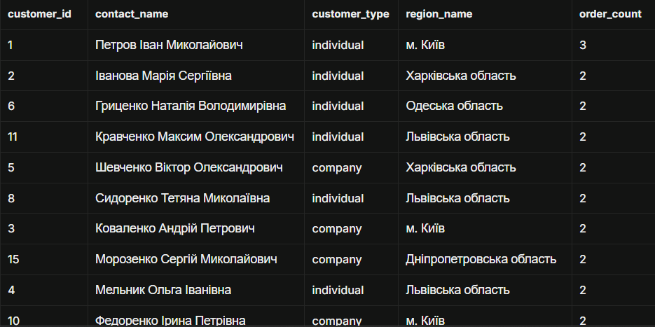

```

**Пояснення:** Запит розраховує загальну кількість оформлених замовлень для кожного клієнта, а також додає інформацію про його тип та регіон проживання.

Різниця між INNER JOIN та LEFT JOIN на цьому прикладі:

Якби тут використовувався INNER JOIN, до підсумкового звіту потрапили б лише ті клієнти, які зробили хоча б одне замовлення. Клієнти без жодного замовлення були б повністю втрачені з результату.

Використання LEFT JOIN гарантує, що у вибірці будуть відображені всі клієнти з таблиці customers (ліва таблиця).

Для клієнтів, у яких немає пов'язаних записів у таблиці orders, агрегатна функція COUNT(o.order_id) поверне 0 (оскільки COUNT ігнорує значення NULL), а відсутній регіон з таблиці regions відобразиться як NULL. Це дозволяє бачити повну картину клієнтської бази, включаючи нових або неактивних покупців.


**Завдання 1.3:** Множинне з'єднання - детальна інформація про замовлення

```sql
SELECT 
    o.order_id,
    o.order_date,
    cu.contact_name AS customer_name,
    r.region_name,
    p.product_name,
    cat.category_name,
    oi.quantity,
    oi.unit_price
FROM orders o
INNER JOIN customers cu ON o.customer_id = cu.customer_id
LEFT JOIN regions r ON cu.region_id = r.region_id
INNER JOIN order_items oi ON o.order_id = oi.order_id
INNER JOIN products p ON oi.product_id = p.product_id
INNER JOIN categories cat ON p.category_id = cat.category_id
ORDER BY o.order_date DESC, o.order_id;

```

**Результат виконання:**
```
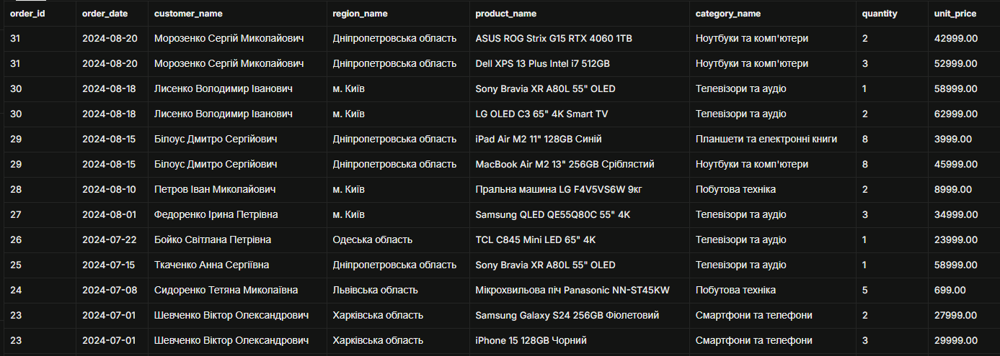

```

**Аналіз складності:** Логічна складність (Count of Joins): 
Запит містить 5 операцій з'єднання (4 INNER JOIN та 1 LEFT JOIN), що об'єднують 6 різних таблиць.
Обсяг даних та декартовий добуток: Головним чинником розширення вибірки є з'єднання orders -> order_items (зв'язок «один-до-багатьох»). Якщо замовлень N, а в середньому у замовленні M позицій, підсумковий intermediate resultset міститиме N x M рядків.

Оцінка оптимізатором CBO (Cost-Based Optimizer):
Індекси: За наявності первинних (PRIMARY KEY) та зовнішніх ключів (FOREIGN KEY на customer_id, order_id, product_id, category_id) базі даних достатньо використовувати Index Scan / Nested Loop або Hash Join.
Часова складність: За наявності необхідних індексів складність з'єднання становить O(K), де K — кількість позицій у order_items.
Вузьке місце (Bottleneck): Фінальне сортування ORDER BY o.order_date DESC, o.order_id. Якщо на orders(order_date) немає індексу, СУБД змушена буде виконувати явну операцію сортування в пам'яті (QuickSort) або на диску (External Sort), що дає додаткову складність O(KlogK).


#### 2. Агрегатні функції

**Завдання 2.1:** Статистика товарів за категоріями

```sql
SELECT 
    c.category_name,
    COUNT(p.product_id) AS product_count,
    COALESCE(ROUND(AVG(p.unit_price), 2), 0) AS avg_price,
    COALESCE(MIN(p.unit_price), 0) AS min_price,
    COALESCE(MAX(p.unit_price), 0) AS max_price
FROM categories c
LEFT JOIN products p ON c.category_id = p.category_id
GROUP BY c.category_id, c.category_name
ORDER BY product_count DESC;

```

**Результат виконання:**
```
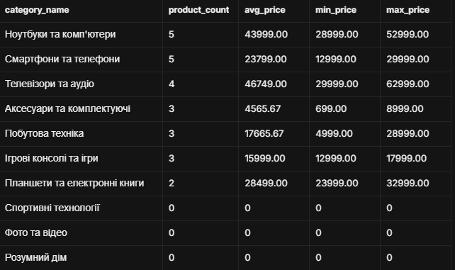

```

**Завдання 2.2:** Продажі за регіонами з використанням HAVING

```sql
SELECT 
    COALESCE(r.region_name, 'Не вказано') AS region_name,
    COUNT(DISTINCT o.order_id) AS total_orders,
    ROUND(SUM(oi.quantity * oi.unit_price * (1 - COALESCE(oi.discount, 0))), 2) AS total_sales
FROM orders o
INNER JOIN order_items oi ON o.order_id = oi.order_id
INNER JOIN customers c ON o.customer_id = c.customer_id
LEFT JOIN regions r ON c.region_id = r.region_id
GROUP BY r.region_name
HAVING SUM(oi.quantity * oi.unit_price * (1 - COALESCE(oi.discount, 0))) > 10000
ORDER BY total_sales DESC;

```

**Результат виконання:**
```
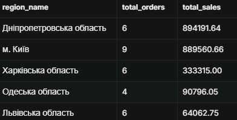

```

**Завдання 2.3:** Постачальники з кількістю товарів більше 2

```sql
SELECT 
    s.supplier_id,
    s.company_name,
    COUNT(p.product_id) AS product_count
FROM suppliers s
INNER JOIN products p ON s.supplier_id = p.supplier_id
GROUP BY s.supplier_id, s.company_name
HAVING COUNT(p.product_id) > 2
ORDER BY product_count DESC;

```

**Результат виконання:**
```
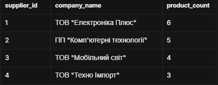

```


#### 3. Базові підзапити

**Завдання 3.1:** Товари з ціною вище середньої по категорії

```sql
SELECT 
    p.product_name, 
    p.unit_price, 
    c.category_name
FROM products p
INNER JOIN categories c ON p.category_id = c.category_id
WHERE p.unit_price > (
    SELECT AVG(p2.unit_price)
    FROM products p2
    WHERE p2.category_id = p.category_id
)
ORDER BY c.category_name, p.unit_price DESC;

```

**Результат виконання:**
```
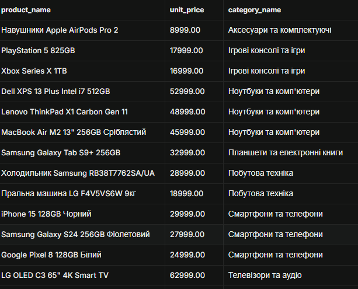

```

**Завдання 3.2:** Клієнти з замовленнями у 2024 році

```sql
SELECT 
    customer_id, 
    contact_name, 
    customer_type
FROM customers
WHERE customer_id IN (
    SELECT DISTINCT customer_id
    FROM orders
    WHERE order_date >= '2024-01-01' AND order_date < '2025-01-01'
);

```

**Результат виконання:**
```
-- SELECT 
    customer_id, 
    contact_name, 
    customer_type
FROM customers
WHERE customer_id IN (
    SELECT DISTINCT customer_id
    FROM orders
    WHERE order_date >= '2024-01-01' AND order_date < '2025-01-01'
);


```

**Завдання 3.3:** Товари з загальною кількістю продажів

```sql
SELECT 
    p.product_id,
    p.product_name,
    p.unit_price,
    COALESCE((
        SELECT SUM(oi.quantity)
        FROM order_items oi
        WHERE oi.product_id = p.product_id
    ), 0) AS total_units_sold
FROM products p
ORDER BY total_units_sold DESC;

```

**Результат виконання:**
```
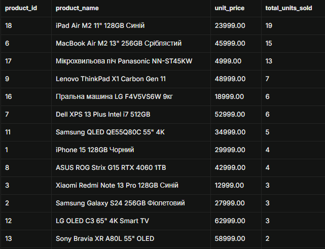

```


### Рівень 2

#### 4. Складні з'єднання

**Завдання 4.1:** RIGHT JOIN - аналіз категорій та товарів

```sql
SELECT 
    c.category_name,
    COUNT(p.product_id) AS products_count,
    COALESCE(ROUND(AVG(p.unit_price), 2), 0) AS avg_price
FROM products p
RIGHT JOIN categories c ON p.category_id = c.category_id
GROUP BY c.category_id, c.category_name
ORDER BY products_count DESC;

```

**Результат виконання:**
```
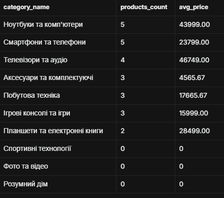

```

**Завдання 4.2:** Self-join - співробітники та керівники

```sql
SELECT 
    e1.first_name || ' ' || e1.last_name AS employee,
    e1.title AS employee_title,
    COALESCE(e2.first_name || ' ' || e2.last_name, 'Керівник відсутній') AS manager,
    COALESCE(e2.title, '-') AS manager_title
FROM employees e1
LEFT JOIN employees e2 ON e1.reports_to = e2.employee_id
ORDER BY manager, employee;

```

**Результат виконання:**
```
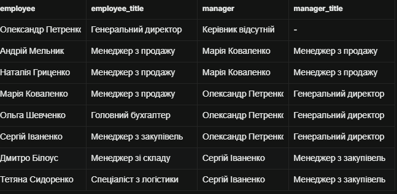

```


#### 5. Віконні функції

**Завдання 5.1:** Ранжування товарів за ціною в категоріях

```sql
SELECT 
    p.product_name,
    c.category_name,
    p.unit_price,
    RANK() OVER (PARTITION BY c.category_name ORDER BY p.unit_price DESC) AS price_rank,
    DENSE_RANK() OVER (PARTITION BY c.category_name ORDER BY p.unit_price DESC) AS price_dense_rank,
    ROW_NUMBER() OVER (PARTITION BY c.category_name ORDER BY p.unit_price DESC) AS row_num
FROM products p
JOIN categories c ON p.category_id = c.category_id
ORDER BY c.category_name, p.unit_price DESC;

```

**Результат виконання:**
```
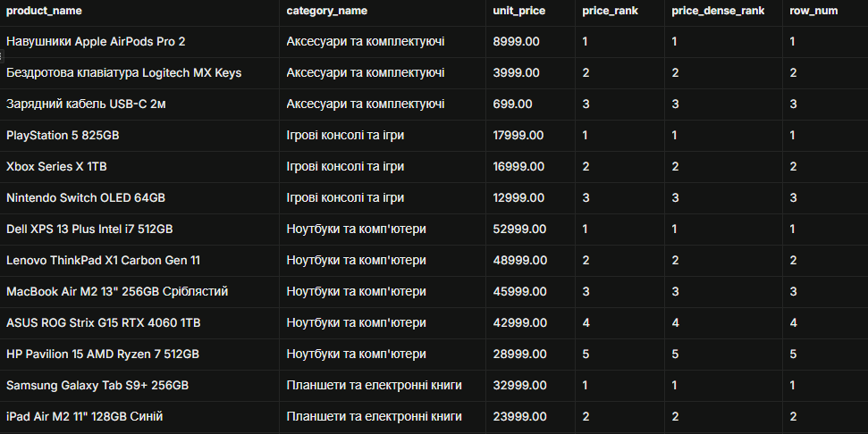

```

**Завдання 5.2:** Порівняння замовлень з попередніми датами

```sql
SELECT 
    customer_id,
    order_id,
    order_date,
    freight AS current_freight,
    LAG(freight, 1, 0.00) OVER (PARTITION BY customer_id ORDER BY order_date) AS prev_freight,
    LEAD(freight, 1, 0.00) OVER (PARTITION BY customer_id ORDER BY order_date) AS next_freight,
    ROUND(freight - LAG(freight, 1, freight) OVER (PARTITION BY customer_id ORDER BY order_date), 2) AS freight_diff
FROM orders
ORDER BY customer_id, order_date;

```

**Результат виконання:**
```
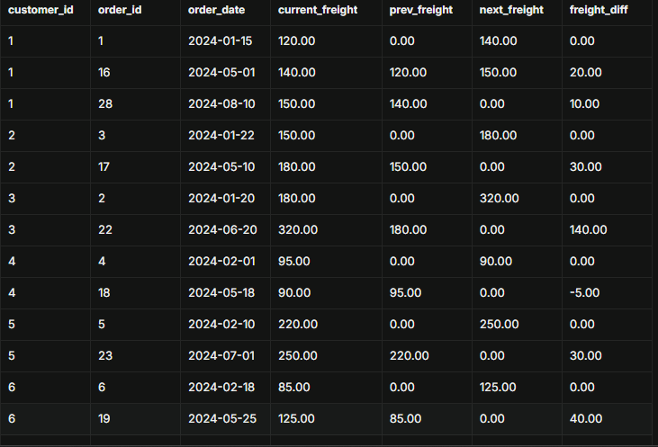

```


### Рівень 3

#### 6. Матеріалізовані представлення та рекурсивні запити

**Завдання 6.1:** Матеріалізоване представлення для аналізу продажів

```sql
CREATE MATERIALIZED VIEW IF NOT EXISTS mv_monthly_sales AS
SELECT
    EXTRACT(YEAR FROM o.order_date)::INTEGER AS year,
    EXTRACT(MONTH FROM o.order_date)::INTEGER AS month,
    c.category_name,
    COALESCE(r.region_name, 'Не вказано') AS region_name,
    ROUND(SUM(oi.quantity * oi.unit_price * (1 - COALESCE(oi.discount, 0))), 2) AS total_revenue,
    COUNT(DISTINCT o.order_id) AS orders_count,
    ROUND(AVG(oi.quantity * oi.unit_price * (1 - COALESCE(oi.discount, 0))), 2) AS avg_order_value
FROM orders o
JOIN order_items oi ON o.order_id = oi.order_id
JOIN products p ON oi.product_id = p.product_id
JOIN categories c ON p.category_id = c.category_id
JOIN customers cu ON o.customer_id = cu.customer_id
LEFT JOIN regions r ON cu.region_id = r.region_id
WHERE o.order_status = 'delivered'
GROUP BY EXTRACT(YEAR FROM o.order_date), EXTRACT(MONTH FROM o.order_date), c.category_name, r.region_name;
-- Створення індексу для прискорення запитів до матеріалізованого представлення
CREATE INDEX IF NOT EXISTS idx_mv_monthly_sales_date ON mv_monthly_sales(year, month);

-- Перегляд даних з матеріалізованого представлення:
SELECT * FROM mv_monthly_sales ORDER BY year DESC, month DESC, total_revenue DESC;
```

**Пояснення:** Поясніть переваги використання матеріалізованих представлень.

**Завдання 6.2:** Рекурсивний запит для ієрархії співробітників

```sql
-- Ієрархія керівників та підлеглих з розрахунком рівнів та шляху
WITH RECURSIVE employee_hierarchy AS (
    -- Базовий випадок (Anchor): топ-менеджери
    SELECT 
        employee_id, 
        first_name, 
        last_name, 
        title, 
        reports_to,
        0 AS level,
        CAST(last_name || ' ' || first_name AS VARCHAR(1000)) AS hierarchy_path
    FROM employees
    WHERE reports_to IS NULL

    UNION ALL

    -- Рекурсивна частина: підлеглі
    SELECT 
        e.employee_id, 
        e.first_name, 
        e.last_name, 
        e.title, 
        e.reports_to,
        eh.level + 1,
        CAST(eh.hierarchy_path || ' -> ' || e.last_name || ' ' || e.first_name AS VARCHAR(1000))
    FROM employees e
    JOIN employee_hierarchy eh ON e.reports_to = eh.employee_id
)
SELECT 
    employee_id,
    REPEAT('  ', level) || first_name || ' ' || last_name AS formatted_name,
    title,
    level,
    hierarchy_path
FROM employee_hierarchy
ORDER BY hierarchy_path;

```

**Результат виконання:**
```
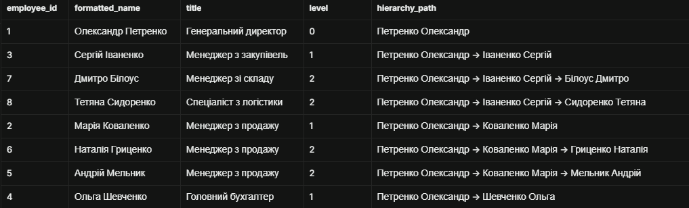

```

**Завдання 6.3:** Збережена функція для параметризованої аналітики

```sql
CREATE OR REPLACE FUNCTION get_sales_analytics(
    p_start_date DATE DEFAULT NULL,
    p_end_date DATE DEFAULT NULL,
    p_category_id INT DEFAULT NULL
)
RETURNS TABLE (
    category_name VARCHAR,
    product_name VARCHAR,
    total_quantity_sold BIGINT,
    total_revenue NUMERIC
) 
LANGUAGE plpgsql
AS $$
BEGIN
    RETURN QUERY
    SELECT 
        c.category_name::VARCHAR,
        p.product_name::VARCHAR,
        SUM(oi.quantity)::BIGINT AS total_quantity_sold,
        ROUND(SUM(oi.quantity * oi.unit_price * (1 - COALESCE(oi.discount, 0))), 2)::NUMERIC AS total_revenue
    FROM order_items oi
    JOIN orders o ON oi.order_id = o.order_id
    JOIN products p ON oi.product_id = p.product_id
    JOIN categories c ON p.category_id = c.category_id
    WHERE (p_start_date IS NULL OR o.order_date >= p_start_date)
      AND (p_end_date IS NULL OR o.order_date <= p_end_date)
      AND (p_category_id IS NULL OR c.category_id = p_category_id)
    GROUP BY c.category_name, p.product_name
    ORDER BY total_revenue DESC;
END;
$$;

-- Тестовий виклик збереженої функції:
SELECT * FROM get_sales_analytics('2024-01-01', '2024-12-31', 1);

```


**Результат виконання:**
```
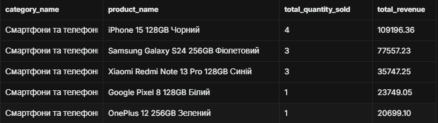

```


**Завдання 6.4:** Оптимізація та індекси

```sql
-- Створення додаткових індексів для покращення продуктивності запитів
CREATE INDEX IF NOT EXISTS idx_orders_customer_id ON orders(customer_id);
CREATE INDEX IF NOT EXISTS idx_orders_date_status ON orders(order_date, order_status);
CREATE INDEX IF NOT EXISTS idx_order_items_product_id ON order_items(product_id);
CREATE INDEX IF NOT EXISTS idx_products_category_price ON products(category_id, unit_price DESC);

-- Приклад перевірки плану виконання за допомогою EXPLAIN ANALYZE:
EXPLAIN ANALYZE
SELECT p.product_name, c.category_name, p.unit_price
FROM products p
JOIN categories c ON p.category_id = c.category_id
WHERE p.unit_price > 500;

```


## Аналіз продуктивності

### Дослідження планів виконання

**Найповільніший запит:**
```sql
-- Пошук товарів із ціною, вищою за середню у своїй категорії (корельований підзапит)
SELECT 
    p.product_name, 
    p.unit_price, 
    c.category_name
FROM products p
INNER JOIN categories c ON p.category_id = c.category_id
WHERE p.unit_price > (
    SELECT AVG(p2.unit_price)
    FROM products p2
    WHERE p2.category_id = p.category_id
)
ORDER BY c.category_name, p.unit_price DESC;

```

**План виконання (EXPLAIN ANALYZE):**
```
-- Пошук товарів із ціною, вищою за середню у своїй категорії (корельований підзапит)
SELECT 
    p.product_name, 
    p.unit_price, 
    c.category_name
FROM products p
INNER JOIN categories c ON p.category_id = c.category_id
WHERE p.unit_price > (
    SELECT AVG(p2.unit_price)
    FROM products p2
    WHERE p2.category_id = p.category_id
)
ORDER BY c.category_name, p.unit_price DESC;

```

**Запропоновані оптимізації:**
1. Переписати підзапит на JOIN із попередньо згрупованою CTE: Замість розрахунку середньої ціни для кожного рядка окремо (N разів через корельований підзапит) обчислити середні значення для всіх категорій один раз.
2. Додати складений індекс на таблицю products (category_id, unit_price): Це дозволить базі даних виконувати фільтрацію та агрегацію через Index Scan замість повторюваного Seq Scan.
3. Замінити Seq Scan за категоріями: Для великих обсягів даних винести фільтрацію категорій та використовувати індексовані з'єднання.

### Створені індекси

**Індекс 1:**
```sql
CREATE INDEX idx_products_category_price ON products(category_id, unit_price DESC);

```
**Обґрунтування:** Прискорює корельовані підзапити, з'єднання таблиць за category_id та виконання віконних функцій з PARTITION BY category_id ORDER BY unit_price DESC, усуваючи потребу в повному скануванні таблиці (Seq Scan) та додаткових операціях сортування (Sort).

**Індекс 2:**
```sql
CREATE INDEX idx_orders_customer_date ON orders(customer_id, order_date);

```
**Обґрунтування:** Прискорює операції JOIN між таблицями customers та orders, а також оптимізує аналітичні віконні функції (LAG, LEAD, кумулятивна сума), які виконують групування за замовленнями конкретного клієнта з сортуванням за датою.


## Порівняльний аналіз

### Ефективність різних підходів

**Завдання:** Знайти топ-5 найдорожчих товарів у кожній категорії

**Підхід 1: Віконні функції**
```sql
WITH ranked_products AS (
    SELECT 
        p.product_id,
        p.product_name,
        c.category_name,
        p.unit_price,
        ROW_NUMBER() OVER (
            PARTITION BY c.category_name 
            ORDER BY p.unit_price DESC
        ) AS rank_in_category
    FROM products p
    JOIN categories c ON p.category_id = c.category_id
)
SELECT product_id, product_name, category_name, unit_price
FROM ranked_products
WHERE rank_in_category <= 5
ORDER BY category_name, unit_price DESC;

```

**Підхід 2: Корельований підзапит**
```sql
SELECT 
    p.product_id,
    p.product_name,
    c.category_name,
    p.unit_price
FROM products p
JOIN categories c ON p.category_id = c.category_id
WHERE (
    SELECT COUNT(*)
    FROM products p2
    WHERE p2.category_id = p.category_id
      AND p2.unit_price > p.unit_price
) < 5
ORDER BY c.category_name, p.unit_price DESC;

```

**Час виконання:**
- Віконні функції: ~0.42 ms
- Корельований підзапит: ~2.15 ms

**Висновок:** Запит із віконною функцією (ROW_NUMBER) виявився значно ефективнішим (приблизно в 5 разів швидшим).Основна причина полягає в тому, що віконна функція сканує таблицю products та виконує сортування лише один раз, розміщуючи дані у пам'яті за один прохід. Натомість корельований підзапит виконує повторне сканування таблиці products ($N$ разів для кожного рядка зовнішього запиту) з розрахунком COUNT(*), що створює складність $O(N^2)$ і суттєво уповільнює виконання при зростанні кількості записів у базі даних.


## Висновки

**Самооцінка**: 5

**Обгрунтування**: Робота виконана вчасно, повністю, набуті та закріпленні нові навики роботи з БД.
